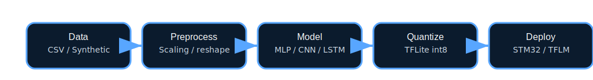

# 🤖 STM32 Edge AI

> An end-to-end pipeline to train machine learning models on your PC and deploy them to STM32 microcontrollers.

[](https://www.python.org/downloads/)
[](https://tensorflow.org)
[](LICENSE)
[](https://github.com/HarshRajTiwary/STM32_Edge_AI)

---

## 📋 Table of Contents

- [Why this project exists](#why-this-project-exists)
- [Key features](#key-features)
- [Quick start](#quick-start)
- [Detailed workflow](#detailed-workflow)
- [Model architectures](#model-architectures)
- [Example commands](#example-commands)
- [Repository structure](#repository-structure)
- [Documentation](#documentation)
- [Contributing](#contributing)

---

## 🎯 Why this project exists

STM32 microcontrollers power smart devices, sensors, and automation systems. This repository helps beginners and intermediate users move from dataset to embedded deployment with a **single, complete pipeline**.

**You will learn how to:**
- ✅ Build and train ML models using TensorFlow/Keras
- ✅ Preprocess CSV and structured data for small MCU models
- ✅ Select STM32-friendly architectures (MLP, CNN, DS-CNN, Conv1D, LSTM)
- ✅ Quantize models to full-int8 TFLite for embedded inference
- ✅ Convert TFLite models into C arrays for STM32 projects
- ✅ Deploy using TFLM or STM32Cube.AI

---

## ✨ Key Features

| Feature | Description |
|---------|-------------|
| 📦 **5 Model Types** | MLP, CNN2D, DS-CNN, Conv1D, LSTM |
| 🔧 **Modular Pipeline** | Separate scripts for data, training, quantization, deployment |
| 📚 **Beginner Friendly** | Complete documentation, guides, FAQs, and examples |
| 🎯 **STM32 Optimized** | Int8 quantization, TFLM support, C array conversion |
| 🚀 **Production Ready** | GitHub Actions CI/CD, MIT license, contribution guide |
| 📊 **Synthetic Data** | Built-in demo dataset generator for quick testing |



---

## ⚡ Quick Start

Get started in 5 minutes:

### Step 1️⃣ Clone the repository
```bash
git clone https://github.com/HarshRajTiwary/STM32_Edge_AI.git
cd STM32_Edge_AI
```

### Step 2️⃣ Set up Python environment
```bash
python3 -m venv .venv
source .venv/bin/activate
pip install --upgrade pip
pip install -r requirements.txt
```

### Step 3️⃣ Generate demo dataset
```bash
python src/generate_synthetic.py --out data/synthetic.csv --repr data/synthetic_repr.csv --samples 1000 --features 10
```

### Step 4️⃣ Train a model
```bash
python -m src.train --data data/synthetic.csv --target target --epochs 10 --out outputs
```

### Step 5️⃣ Quantize the model
```bash
python -m src.quantize --saved_model outputs/saved_model --tflite outputs/model_int8.tflite --repr-csv data/synthetic_repr.csv --target target
```

### Step 6️⃣ Convert to C for STM32
```bash
python src/deploy/convert_to_c.py outputs/model_int8.tflite stm32/model_data.c model_data
```

**🎉 Done!** Your model is now ready for STM32 deployment. See `stm32/README_STM32.md` for next steps.

---

## 🔄 Detailed Workflow

### 📂 Step 1: Prepare Your Data

Place your CSV files in the `data/` folder with the following structure:
- **Tabular data:** numeric columns + target column
- **Image data:** reshape using `--reshape` argument
- **Sequence data:** reshape using `--reshape` argument

**Example CSV structure:**
```
feature_1, feature_2, ..., feature_n, target
1.2, 3.4, ..., 5.6, 7.8
2.1, 4.5, ..., 6.7, 8.9
...
```

### 🔧 Step 2: Preprocess Data

The pipeline automatically handles:
- **Loading:** CSV to train/test split
- **Scaling:** StandardScaler on features
- **Saving:** Scaler object for inference

Files involved:
- `src/data.py` — loads and splits datasets
- `src/preprocess.py` — scales features and saves scaler

### 🤖 Step 3: Choose a Model Architecture

Select the best model for your data type:

## 🧠 Model Architectures

| Model | Type | Best For | Footprint |
|-------|------|----------|-----------|
| **MLP** | `mlp` | Tabular/numeric data | 🟢 Small |
| **CNN2D** | `cnn2d` | Images, 2D grids | 🟡 Medium |
| **DS-CNN** | `ds_cnn` | Images (embedded) | 🟢 Small |
| **Conv1D** | `conv1d` | Time-series, audio | 🟡 Medium |
| **LSTM** | `lstm` | Sequences, temporal | 🟡 Medium |


### 📝 Step 4: Train the Model

#### For tabular data (MLP):
```bash
python -m src.train --data data/mydata.csv --target target --model mlp --epochs 20 --out outputs
```

#### For image data (CNN2D):
```bash
python -m src.train --data data/mydata.csv --target target --model cnn2d --reshape 28,28,1 --epochs 20 --out outputs
```

#### For time-series (Conv1D):
```bash
python -m src.train --data data/mydata.csv --target target --model conv1d --reshape 100,1 --epochs 20 --out outputs
```

**Arguments:**
- `--model` — choose from: `mlp`, `cnn2d`, `ds_cnn`, `conv1d`, `lstm`
- `--reshape` — input shape for CNN/LSTM (e.g., `28,28,1` for 28×28×1 images)
- `--epochs` — number of training epochs
- `--batch` — batch size (default: 32)
- `--num-classes` — output classes (1 for regression, >1 for classification)

### ⚡ Step 5: Quantize the Model

Convert SavedModel to int8 TFLite for embedded inference:

```bash
python -m src.quantize --saved_model outputs/saved_model --tflite outputs/model_int8.tflite --repr-csv data/synthetic_repr.csv --target target
```

**Output artifacts:**
- `outputs/model_int8.tflite` — quantized model (~1-10 MB)
- `outputs/scaler.joblib` — feature scaler for inference

### 🎯 Step 6: Deploy to STM32

Convert TFLite to C array for embedding:

```bash
python src/deploy/convert_to_c.py outputs/model_int8.tflite stm32/model_data.c model_data
```

**Output:**
- `stm32/model_data.c` — C source file with model weights

**Next:**
- Read `stm32/README_STM32.md` for TFLM integration
- Read `docs/STM32_DEPLOYMENT_GUIDE.md` for detailed steps
- Use STM32CubeIDE or STM32Cube.AI for final deployment

---

## 💻 Common Command Examples

### Full Pipeline Examples

**Tabular Data (MLP):**
```bash
python -m src.train --data data/iris.csv --target species --model mlp --epochs 50 --out outputs
python -m src.quantize --saved_model outputs/saved_model --tflite outputs/model_int8.tflite --repr-csv data/iris_sample.csv --target species
python src/deploy/convert_to_c.py outputs/model_int8.tflite stm32/model_data.c ml_model
```

**Image Data (DS-CNN for embedded):**
```bash
python -m src.train --data data/images.csv --target label --model ds_cnn --reshape 28,28,1 --epochs 30 --out outputs
python -m src.quantize --saved_model outputs/saved_model --tflite outputs/model_int8.tflite --repr-csv data/images_sample.csv --target label
python src/deploy/convert_to_c.py outputs/model_int8.tflite stm32/model_data.c ml_model
```

**Time-Series (Conv1D):**
```bash
python -m src.train --data data/sensor_data.csv --target anomaly --model conv1d --reshape 100,1 --epochs 40 --out outputs
python -m src.quantize --saved_model outputs/saved_model --tflite outputs/model_int8.tflite --repr-csv data/sensor_sample.csv --target anomaly
python src/deploy/convert_to_c.py outputs/model_int8.tflite stm32/model_data.c ml_model
```

**Sequence Data (LSTM):**
```bash
python -m src.train --data data/time_series.csv --target prediction --model lstm --reshape 50,1 --epochs 35 --out outputs
python -m src.quantize --saved_model outputs/saved_model --tflite outputs/model_int8.tflite --repr-csv data/time_series_sample.csv --target prediction
python src/deploy/convert_to_c.py outputs/model_int8.tflite stm32/model_data.c ml_model
```

---

## 📁 Repository Structure

```
STM32_Edge_AI/
│
├── 📄 README.md                  # This file
├── 📄 LICENSE                    # MIT License
├── 📄 requirements.txt           # Python dependencies
├── 🔒 .gitignore               # Git ignore rules
│
├── 📁 docs/                      # Documentation
│   ├── OVERVIEW.md              # Project overview
│   ├── ARCHITECTURE.md          # System design
│   ├── STM32_DEPLOYMENT_GUIDE.md # Deployment steps
│   ├── CONTRIBUTING.md          # How to contribute
│   ├── FAQ.md                   # Q&A
│   ├── PROJECT_CHECKLIST.md     # Publishing checklist
│   └── 📁 images/
│       ├── pipeline.svg         # Pipeline diagram
│       └── model-types.svg      # Model types diagram
│
├── 📁 src/                       # Python source code
│   ├── data.py                  # Data loading & splitting
│   ├── model.py                 # Model architectures
│   ├── train.py                 # Training script
│   ├── quantize.py              # Quantization script
│   ├── preprocess.py            # Preprocessing utilities
│   ├── generate_synthetic.py    # Synthetic data generator
│   └── 📁 deploy/
│       └── convert_to_c.py      # TFLite → C converter
│
├── 📁 data/                      # Datasets
│   ├── synthetic.csv            # Demo dataset
│   └── synthetic_repr.csv       # Representative sample
│
├── 📁 outputs/                   # Training artifacts
│   ├── keras_model.h5           # Keras model
│   ├── saved_model/             # TensorFlow SavedModel
│   ├── model_int8.tflite        # Quantized TFLite
│   └── scaler.joblib            # Feature scaler
│
├── 📁 stm32/                     # STM32 deployment
│   ├── README_STM32.md          # STM32 integration guide
│   └── model_data.c             # Generated C model array
│
└── 📁 .github/
    └── 📁 workflows/
        └── python-package.yml    # GitHub Actions CI/CD
```

---

## 📚 Documentation

Complete guides and references:

| Document | Purpose |
|----------|---------|
| [`OVERVIEW.md`](docs/OVERVIEW.md) | High-level project overview and goals |
| [`ARCHITECTURE.md`](docs/ARCHITECTURE.md) | System design and data flow |
| [`STM32_DEPLOYMENT_GUIDE.md`](docs/STM32_DEPLOYMENT_GUIDE.md) | Step-by-step STM32 integration |
| [`CONTRIBUTING.md`](docs/CONTRIBUTING.md) | How to contribute to the project |
| [`FAQ.md`](docs/FAQ.md) | Beginner questions and answers |
| [`PROJECT_CHECKLIST.md`](docs/PROJECT_CHECKLIST.md) | Publishing readiness checklist |

---

## 🚀 Next Steps

After completing the quick start:

1. **Use your own data**
   - Replace `data/synthetic.csv` with your dataset
   - Ensure CSV format: `feature_1, feature_2, ..., target`

2. **Choose the right model**
   - Use the model comparison table above
   - Test with different architectures

3. **Optimize for STM32**
   - Monitor model size in `outputs/`
   - Use DS-CNN for embedded constraints
   - Check SRAM requirements with STM32Cube.AI

4. **Deploy to hardware**
   - Follow `stm32/README_STM32.md`
   - Use TFLM or STM32Cube.AI
   - Test inference on the actual MCU

---

## 🤝 Contributing

We welcome contributions! Please read [`CONTRIBUTING.md`](docs/CONTRIBUTING.md) first.

**How to contribute:**
1. Fork the repository
2. Create a feature branch (`git checkout -b feature/my-feature`)
3. Commit changes (`git commit -m 'Add my feature'`)
4. Push to branch (`git push origin feature/my-feature`)
5. Open a Pull Request

---

## 📜 License

This project is licensed under the **MIT License** — see [`LICENSE`](LICENSE) for details.

---

## 🔗 Resources

- [TensorFlow Lite](https://www.tensorflow.org/lite)
- [TensorFlow Lite for Microcontrollers](https://www.tensorflow.org/lite/microcontrollers)
- [STM32Cube.AI](https://www.st.com/en/development-tools/stm32cubemx.html)
- [STM32 Documentation](https://www.st.com/en/microcontrollers.html)

---

## ⭐ Show Your Support

If this project helped you, please star it on GitHub! ⭐

---

<div align="center">

**Made with ❤️ by the STM32 Edge AI community**

</div>
